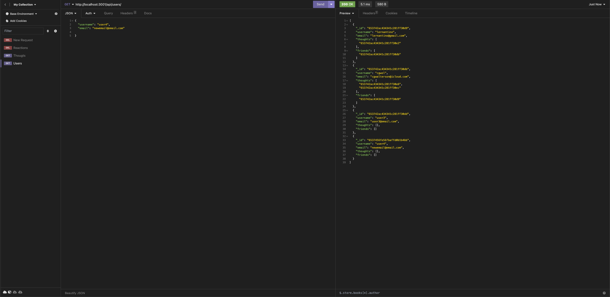

# Social Network API

## Description 
  The backend api of a social media network that uses mongoDB, express.js, and Mongoose packages.

## Table of Contents
  
  - [Description](#description)
  - [Installation](#installation)
  - [Usage](#usage)
  - [License](#license)
  - [Questions](#questions)

## Installation
Install the required npm packages with 

    npm install

MongoDB must be installed on the system in order to run

## Usage

To use the application on a local server, run in the terminal in the application directory and use the command 

    npm start

Insomnia or an equivalent application is used to see the routes in action

[Video Link](https://drive.google.com/file/d/1NBnh4pETV0fQBfAEna6y7mQigDRxZPL4/view?usp=sharing)

## License
  This application is licensed under the [MIT](https://choosealicense.com/licenses/mit/) license
  
## Questions
  Created by: [cgwol](https://github.com/cgwol/)
  
  Contact with any further questions at [cgwalterson@icloud.com](mailto:cgwalterson@icloud.com)
  